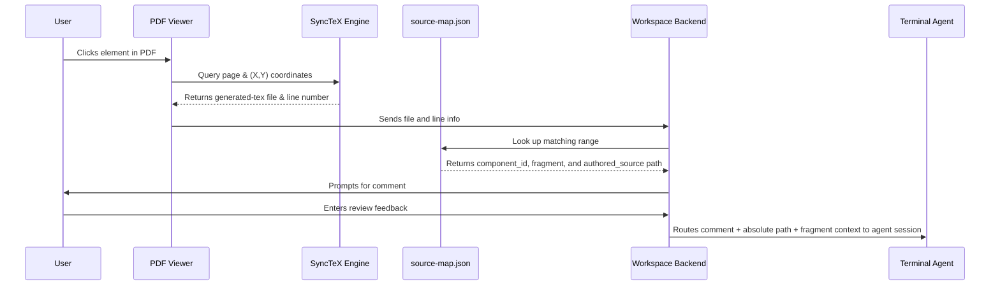

# Interactive mathpub Workspace: GUI Design Specification

This document details the interface layout, feature specifications, and architectural approach for building an interactive authoring environment directly into the `mathpub` Nix flake.

## 1. Interface Mockup

Below is a design mockup of the split-window workspace showing the terminal emulator on the left and the annotatable PDF with SyncTeX highlighting on the right:


---

## 2. Layout & Interactions

The interface is divided into two primary vertical columns:

*   **Left Pane: Terminal Emulator**
    *   **Agent Pluggability**: Instead of a hardcoded chat UI, this panel embeds a full-featured terminal emulator (e.g., via `xterm.js`).
    *   **User Control**: The user runs their shell or preferred CLI chatbot agent (e.g., `antigravity-cli`, `claude-code`, standard Python/Sage REPLs). The workspace tool provides the terminal window but does not control the agent inside it.
*   **Right Pane: SyncTeX-Enabled PDF Viewer**
    *   **Visual Highlights**: The PDF viewer parses SyncTeX outputs to overlay selectable boundary boxes around page elements (lessons, examples, or equations).
    *   **Annotating elements**: Hovering over or clicking a textbook element reveals options to add feedback, copy details, or inspect the source. Adding feedback registers a comment associated with that specific TeX source code line.

---

## 3. Connecting PDF Layout Elements to Source Components

To bridge visual elements in the generated PDF with the source code components in the filesystem, the workspace utilizes **SyncTeX** and compiler-generated **source maps**:



### Detailed Mapping Steps:
1.  **Code Markers**: During compilation, `src/mathpub/render.py` wraps generated TeX output in structured comments containing metadata:
    `% BEGIN mathpub {"component_id": "algebra.cumulative.01-linear", "fragment": "prompt", "authored_source": "questions/algebra/.../prompt.tex"}`
2.  **SyncTeX Generation**: Building the document generates a SyncTeX database (`.synctex.gz`).
3.  **Coordinate Lookup**: When the user clicks an element in the PDF viewer, the workspace requests the matching generated `.tex` line number using SyncTeX.
4.  **Source Resolution**: The backend matches the generated line number against the `% BEGIN mathpub` JSON comments or the parsed `source-map.json` array.
5.  **Agent Context**: The workspace feeds the user's review feedback, alongside the exact `component_id`, `fragment` (e.g., `prompt`), and absolute path to the `authored_source` file, into the terminal shell/agent.

## 4. Sync-Aware PDF Componentry (macOS Native Integration)

To deliver a high-performance experience, the workspace avoids slow JavaScript-only PDF redraw loops by combining native platform capabilities with a transparent interaction layer:

*   **Native WebKit/Chromium Rendering**: The PDF file is embedded in a standard HTML `<iframe>` or `<embed>` element. On macOS, WebKit (Electron/Safari) automatically uses the native Quartz/PDFKit rendering backend, providing smooth scrolling, subpixel text anti-aliasing, and trackpad pinch-to-zoom.
*   **Transparent Interactive Overlay**: A dynamically sized transparent HTML `div` overlay is positioned exactly on top of the PDF iframe.
    *   The workspace backend reads the SyncTeX database to build a lightweight spatial index of coordinate bounding boxes for the current page.
    *   Mouse hovers and clicks are intercepted by the HTML overlay. Hovering over a box outlines the textbook element (e.g. green SyncTeX outline), and clicking it sends the page-space $(X, Y)$ coordinate to the backend to locate the source code without disturbing the native PDF rendering underneath.

---

## 5. Incremental & Fast PDF Regeneration

To achieve near-instantaneous page refreshes when a user edits individual components, the workspace utilizes three levels of build optimizations:

1.  **Component Cache**: The `mathpub` compiler hashes each component's configuration (`component.toml`), seed, and generator (`generate.sage`). If the hash matches the cache, execution of the Sage/Python generator is skipped, and pre-generated TeX fragments are pulled instantly.
2.  **LaTeX Format Dumps (`.fmt`)**: Standard LuaLaTeX compilations spend 90% of their time parsing packages (tikz, amsmath, siunitx, geometry). The workspace pre-compiles these packages into a custom binary format dump (`mathpub.fmt`). Compilation then starts directly from the user's content, reducing standard document compiling times to sub-second.
3.  **Partial Chapter/Section Compilations**: Instead of rebuilds of the entire book, the compiler compiles only the single lesson or chapter currently being viewed. The resulting small PDF pages are spliced or hot-swapped into the viewer, ensuring the edit-to-preview loop takes less than 500 milliseconds.

---

## 6. Nix Flake Integration

The workspace tool is packaged directly into the public `mathpub` repository. It is executed via the Nix flake apps:

```bash
nix run .#mathpub-workspace
```

This launches the local Python backend, sets up WebSocket communication with the terminal socket, and opens the frontend in the browser.
