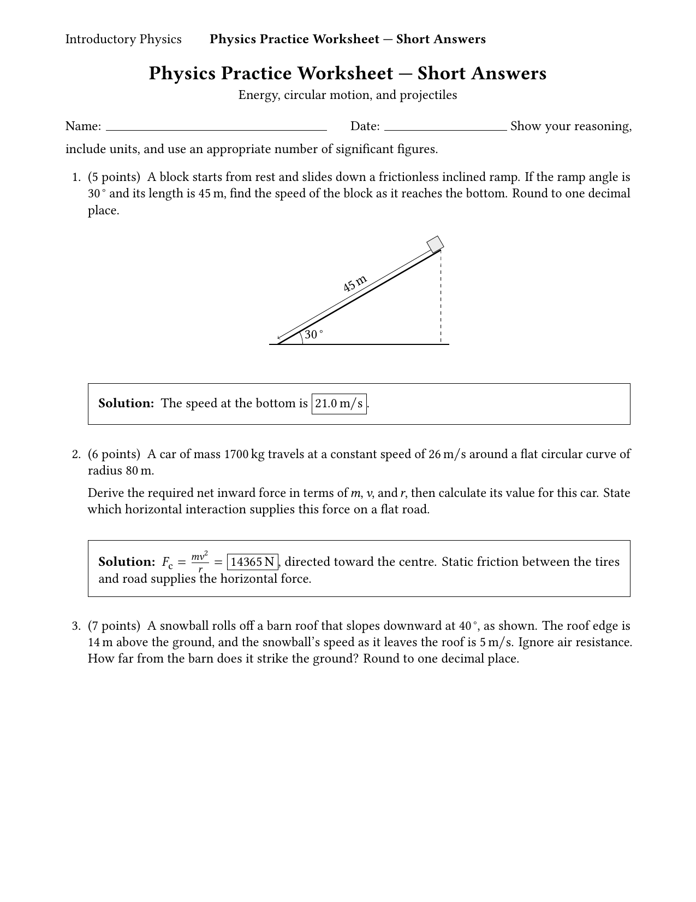
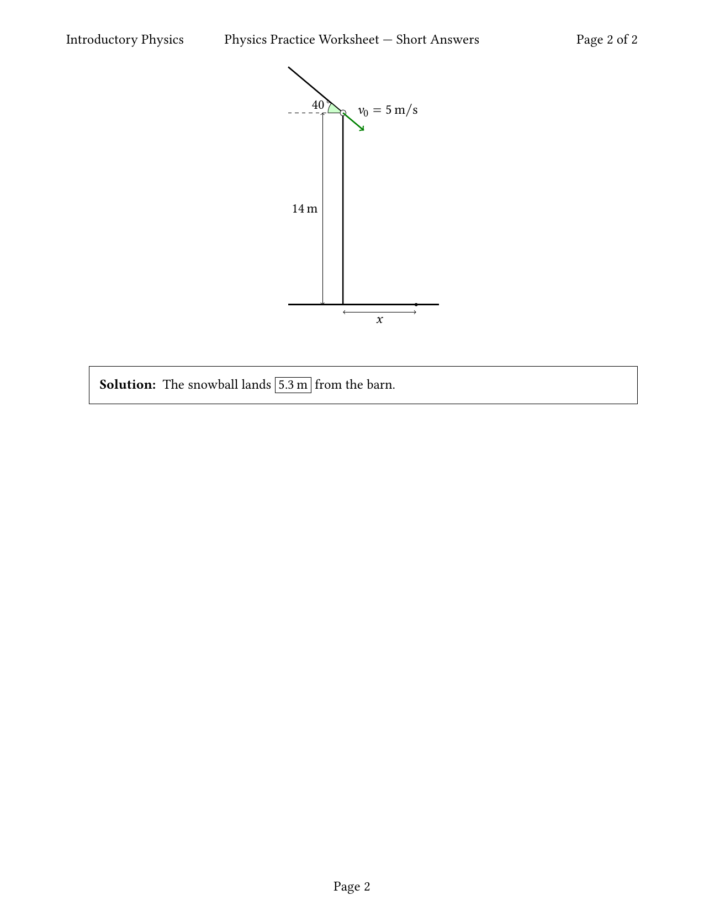
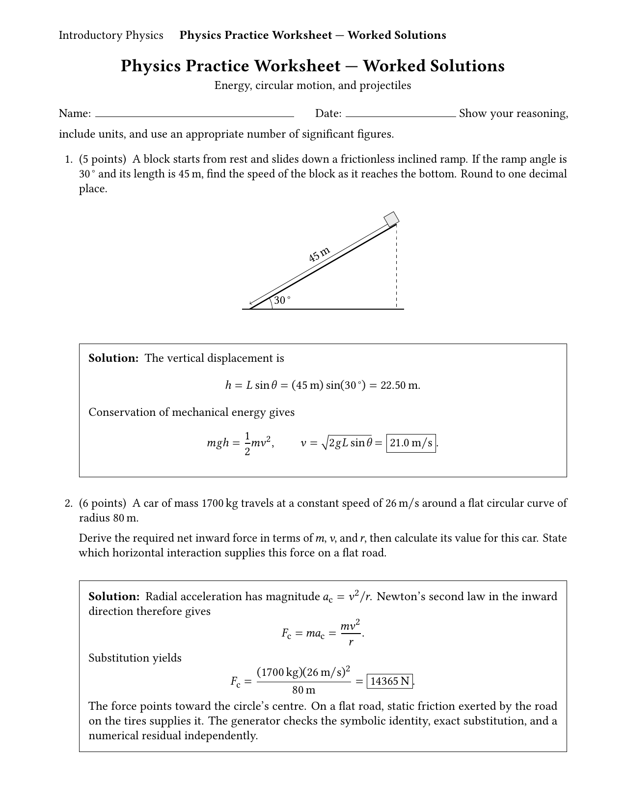
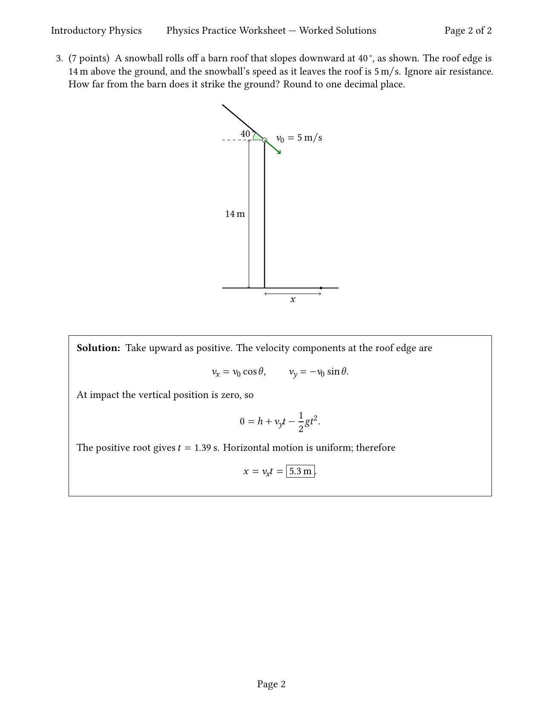
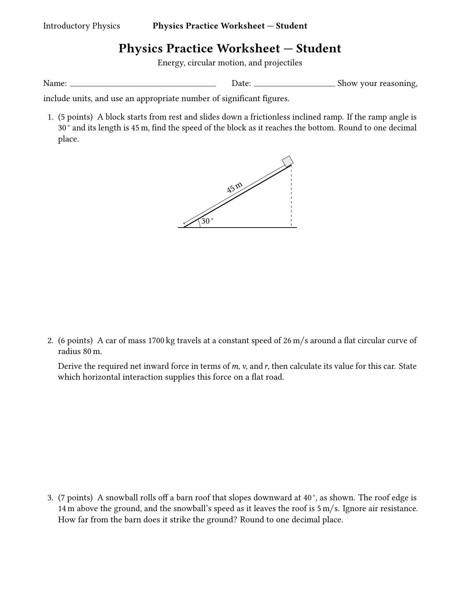
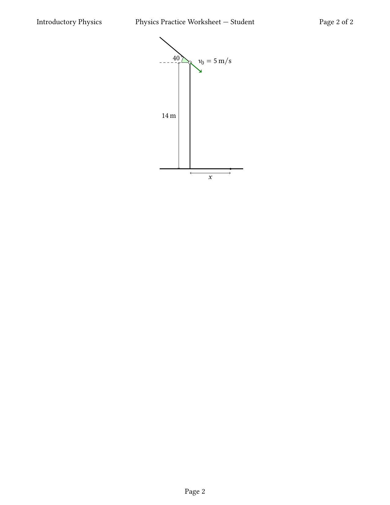
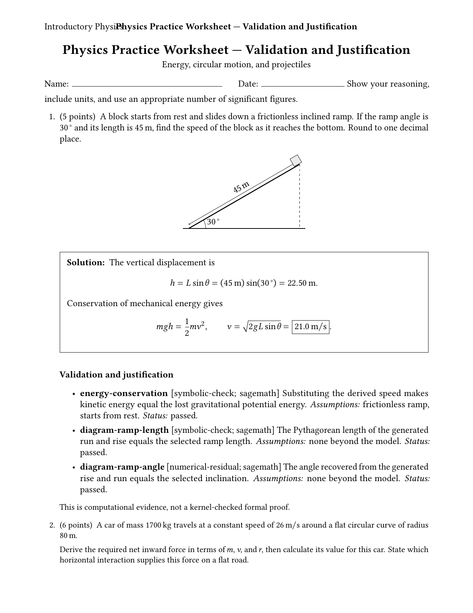
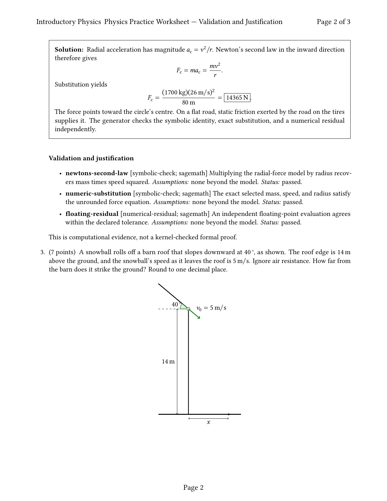
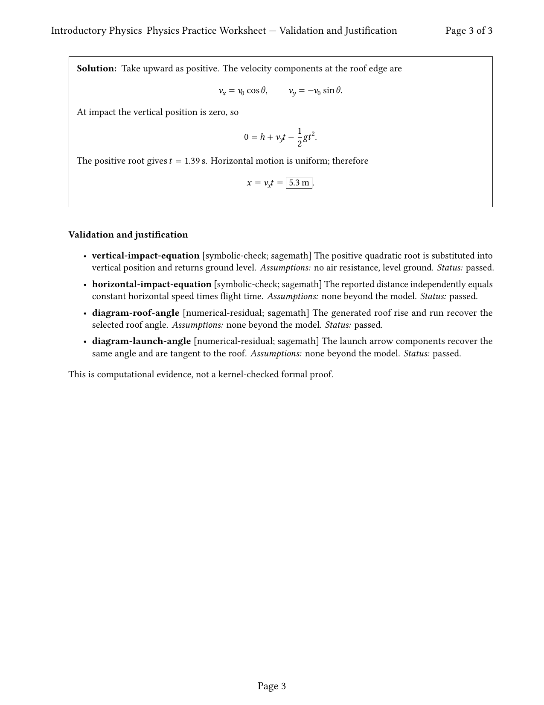

# E2E Visual Verification Run: Physics Practice Worksheet (Mechanics)

This walkthrough is auto-generated by the E2E visual test run. Verify the page rendering below:

## Projection: `answers`

### Page 1

**Layout Checklist:**
- [x] Page structure and spacing for `answers` is correct
- [x] Font selection and typography contains no replacements
- [x] TikZ and math formulas render properly

### Page 2

**Layout Checklist:**
- [x] Page structure and spacing for `answers` is correct
- [x] Font selection and typography contains no replacements
- [x] TikZ and math formulas render properly

---

## Projection: `solutions`

### Page 1

**Layout Checklist:**
- [x] Page structure and spacing for `solutions` is correct
- [x] Font selection and typography contains no replacements
- [x] TikZ and math formulas render properly

### Page 2

**Layout Checklist:**
- [x] Page structure and spacing for `solutions` is correct
- [x] Font selection and typography contains no replacements
- [x] TikZ and math formulas render properly

---

## Projection: `student`

### Page 1

**Layout Checklist:**
- [x] Page structure and spacing for `student` is correct
- [x] Font selection and typography contains no replacements
- [x] TikZ and math formulas render properly

### Page 2

**Layout Checklist:**
- [x] Page structure and spacing for `student` is correct
- [x] Font selection and typography contains no replacements
- [x] TikZ and math formulas render properly

---

## Projection: `validation`

### Page 1

**Layout Checklist:**
- [x] Page structure and spacing for `validation` is correct
- [x] Font selection and typography contains no replacements
- [x] TikZ and math formulas render properly

### Page 2

**Layout Checklist:**
- [x] Page structure and spacing for `validation` is correct
- [x] Font selection and typography contains no replacements
- [x] TikZ and math formulas render properly

### Page 3

**Layout Checklist:**
- [x] Page structure and spacing for `validation` is correct
- [x] Font selection and typography contains no replacements
- [x] TikZ and math formulas render properly

---

