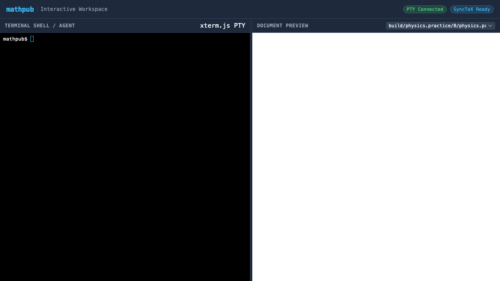

# E2E Visual Verification: Interactive GUI Workspace

Auto-generated visual walkthrough for `tests/e2e/002_gui_workspace`:

## Initial Workspace Load (WebKit / Safari Engine)

**Verifications:**
- [x] Header brand and subtitle render correctly
- [x] Isolated PTY terminal emulator loads with clean prompt
- [x] PDF viewer dropdown populates and renders document in WebKit preview
