# E2E Visual Verification: Interactive GUI Workspace

Auto-generated visual walkthrough for `tests/e2e/002_gui_workspace`:

The committed images below are exact Playwright WebKit renderer baselines. On Linux,
`nix run .#mathpub-gui-e2e` separately launches the packaged Tauri application through
`tauri-driver`, verifies the PTY and PDF preview, and writes a native screenshot artifact to
`build/e2e/tauri-driver.png`.

## Initial Workspace Load (WebKit / Safari Engine)

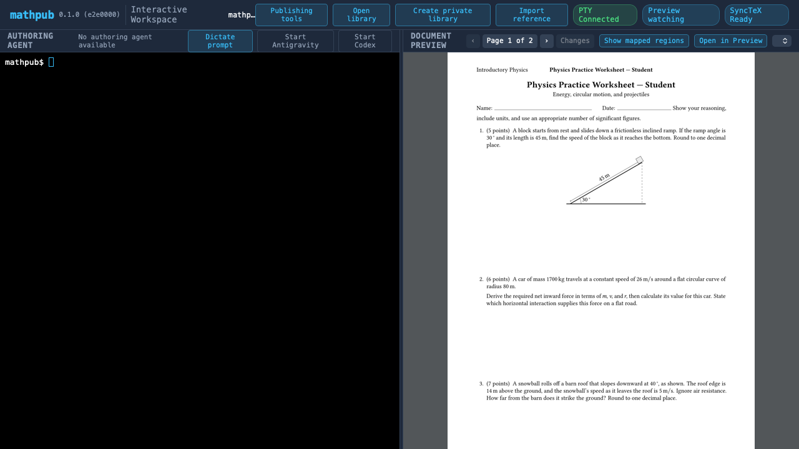

## macOS Dictation Prompt

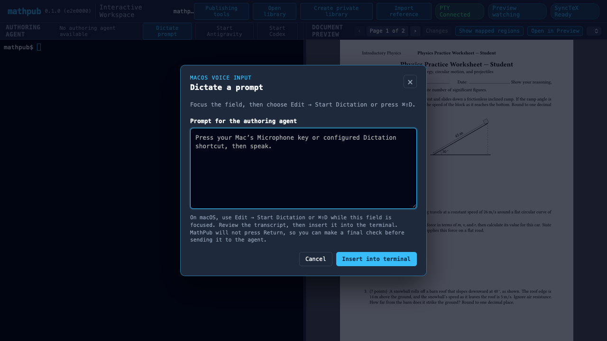

## Hovered SyncTeX Region

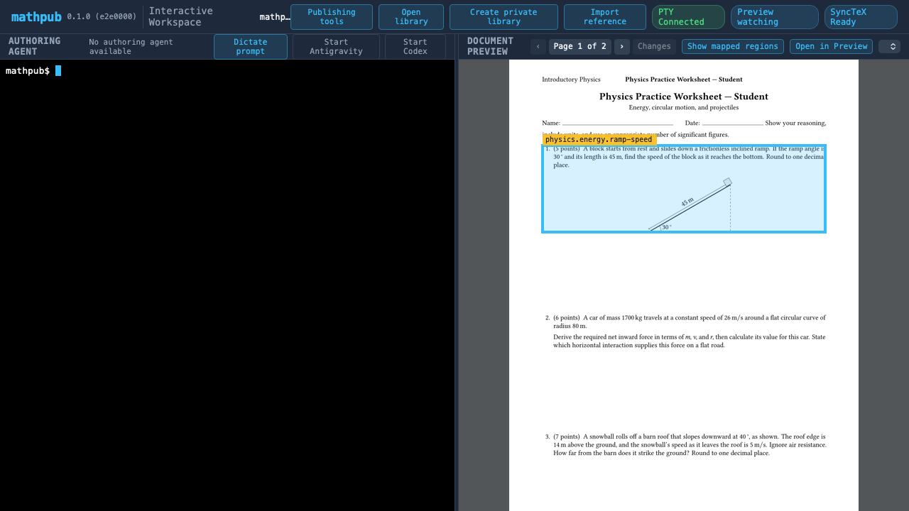

## SyncTeX Mapped Regions

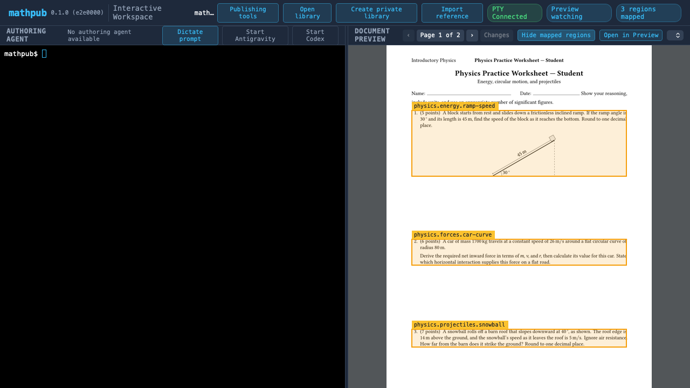

## Element Feedback Dialog

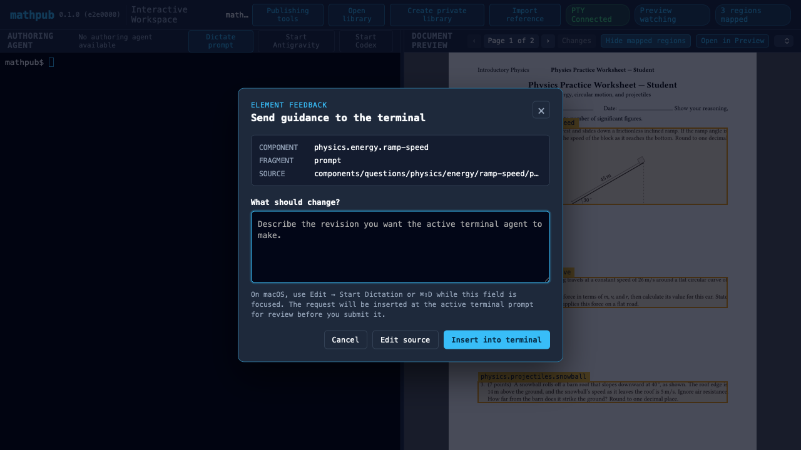

## Feedback Inserted into the Active Terminal

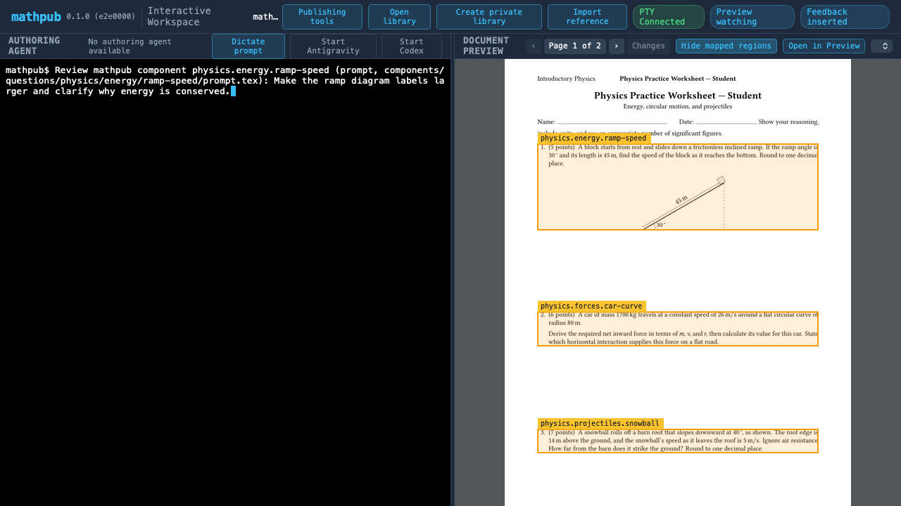

## Page Two with Page-Specific SyncTeX Mappings

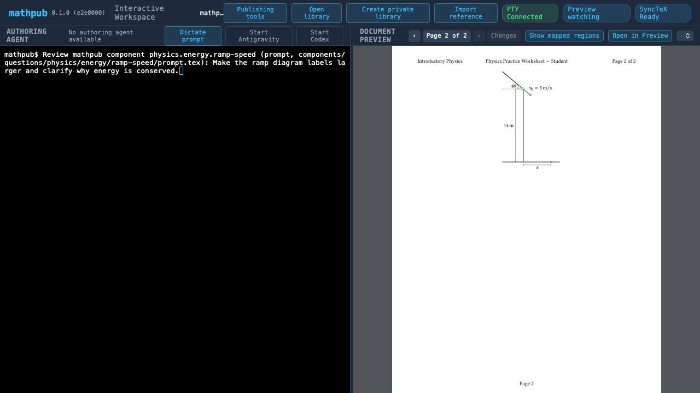

## Quick TeX Editor

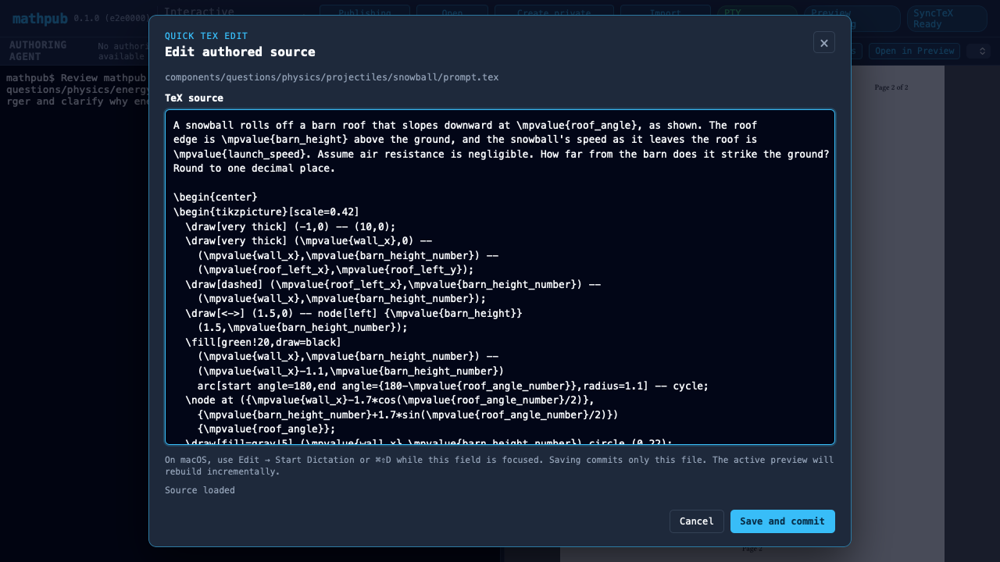

## Quick Edit Committed and Preview Updated

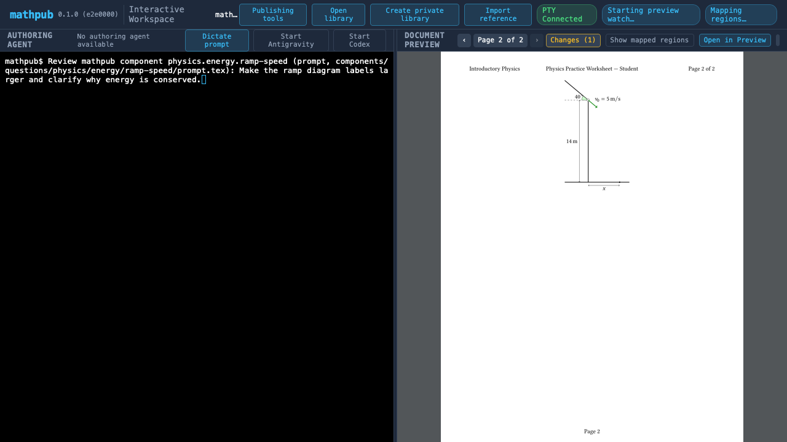

## Presentation Slide Quick Editor

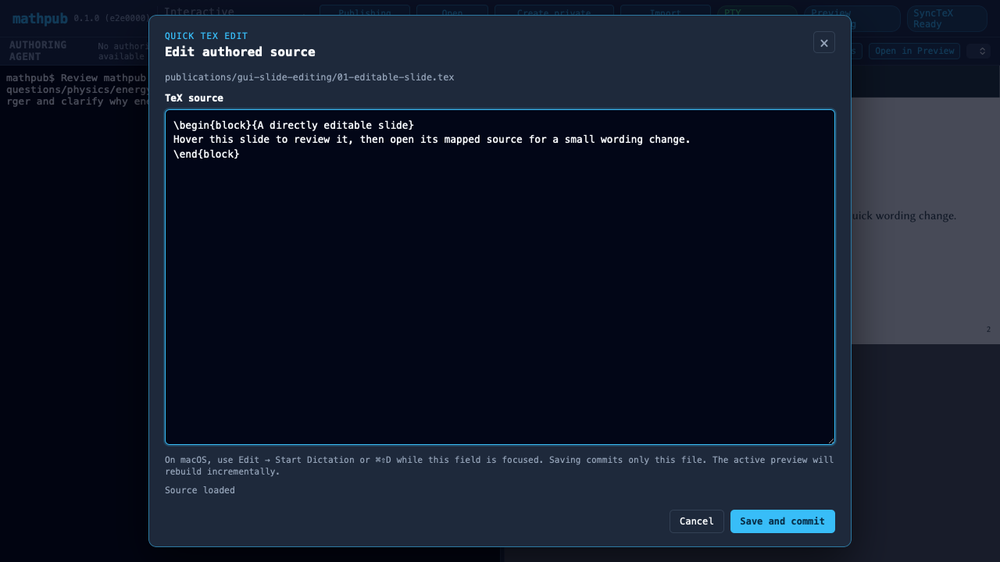

## Presentation Slide Committed and Rebuilt

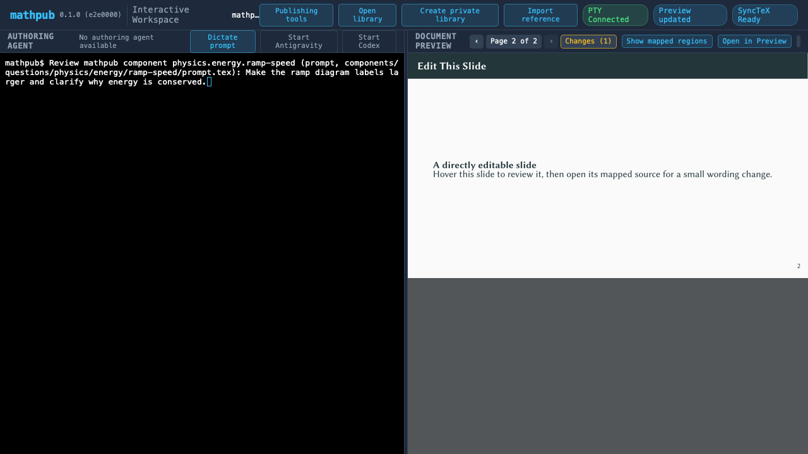

**Verifications:**
- [x] Header brand and subtitle render correctly
- [x] The package version and build Git revision are visible
- [x] Isolated PTY terminal emulator loads with clean prompt
- [x] macOS Dictation receives a focused standard text field and inserts without executing
- [x] PDF dropdown loads and displays the rendered first page
- [x] Hovering reveals one clickable mapped region without a prior toggle
- [x] Mapped component regions align with their rendered PDF content
- [x] Clicking a mapped region opens source-aware feedback controls
- [x] Feedback is inserted into the PTY for review without being executed
- [x] Multipage navigation loads page-specific PDF content and mappings
- [x] A mapped TeX source can be edited directly in the GUI
- [x] Saving commits only that source file in Git
- [x] The committed edit reuses instances and hot-swaps the active page within budget
- [x] A Beamer slide exposes a hoverable source-mapped region
- [x] Presentation feedback identifies the authored slide fragment
- [x] A quick slide edit commits only its TeX source and rebuilds the preview
- [x] The selected built PDF can be opened in the native viewer
