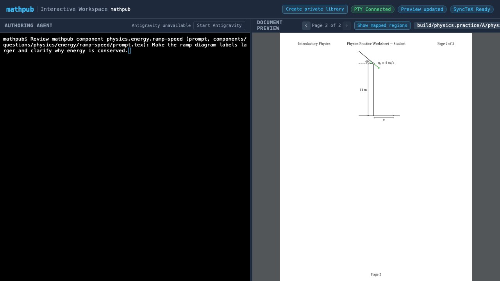

# E2E Visual Verification: Interactive GUI Workspace

Auto-generated visual walkthrough for `tests/e2e/002_gui_workspace`:

The committed images below are exact Playwright WebKit renderer baselines. On Linux,
`nix run .#mathpub-gui-e2e` separately launches the packaged Tauri application through
`tauri-driver`, verifies the PTY and PDF preview, and writes a native screenshot artifact to
`build/e2e/tauri-driver.png`.

## Initial Workspace Load (WebKit / Safari Engine)

## Hovered SyncTeX Region

## SyncTeX Mapped Regions

## Element Feedback Dialog

## Feedback Inserted into the Active Terminal

## Incremental Preview Updated

**Verifications:**
- [x] Header brand and subtitle render correctly
- [x] Isolated PTY terminal emulator loads with clean prompt
- [x] PDF dropdown loads and displays the rendered first page
- [x] Hovering reveals one clickable mapped region without a prior toggle
- [x] Mapped component regions align with their rendered PDF content
- [x] Clicking a mapped region opens source-aware feedback controls
- [x] Feedback is inserted into the PTY for review without being executed
- [x] Authored changes reuse instances and hot-swap the active PDF
