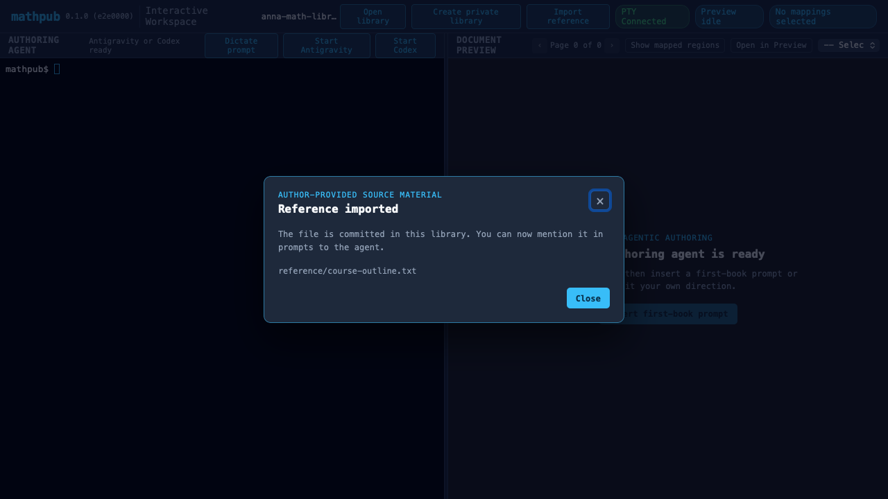
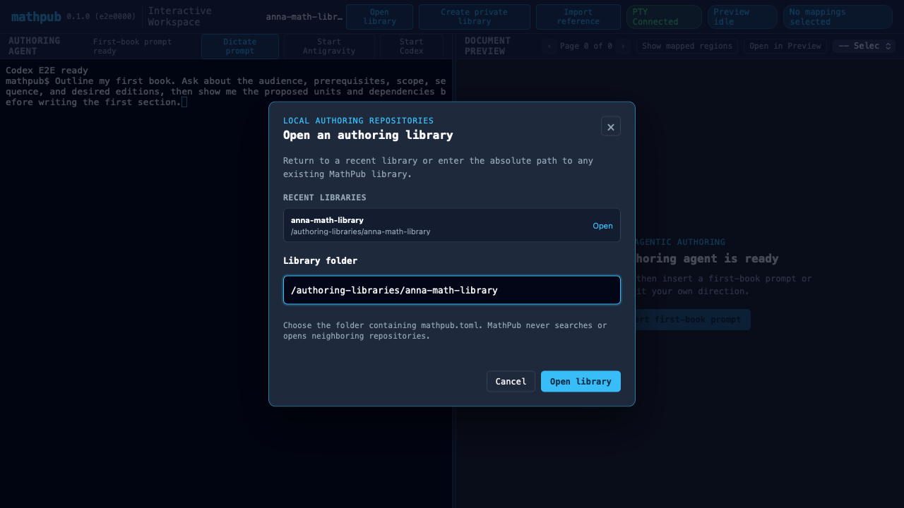

# E2E Visual Verification: Agentic Onboarding

This scenario exercises the first agentic authoring vertical slice:

1. Open the MathPub workspace without an existing project.
2. Create a new local private authoring library from the GUI.
3. Import a reference through the file chooser and verify that only
   `reference/course-outline.txt` is committed.
4. Reconnect the PTY with the new library as its working directory.
5. Verify that both agent choices are available, launch the configured Codex-compatible command
   through the library's locked `nix develop` environment, and confirm that it can find the
   imported file, `pdftotext`, and the completion MCP tool.
6. Insert the first-book planning prompt for the agent.
7. Open the library chooser and verify that the new library appears in the recent list.
8. Open an arbitrary existing MathPub library by its folder path.
9. Return to the new library from the persistent recent-library list.

The test uses a deterministic local command instead of real model credentials. The committed
WebKit baseline has zero-pixel tolerance on macOS CI.

