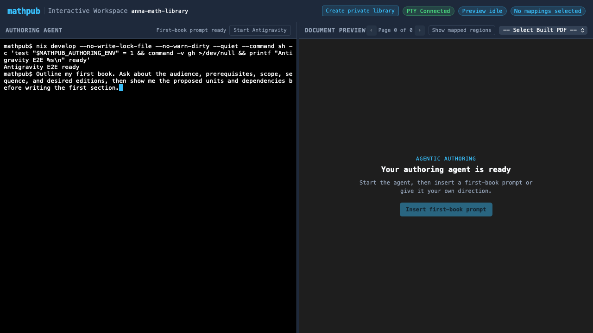

# E2E Visual Verification: Agentic Onboarding

This scenario exercises the first agentic authoring vertical slice:

1. Open the MathPub workspace without an existing project.
2. Create a new local private authoring library from the GUI.
3. Reconnect the PTY with the new library as its working directory.
4. Launch a configured Antigravity-compatible CLI command through the library's locked
   `nix develop` environment and verify that its declared tools are available.
5. Insert the first-book planning prompt for the agent.

The test uses a deterministic local command instead of real model credentials. The committed
WebKit baseline has zero-pixel tolerance on macOS CI.

